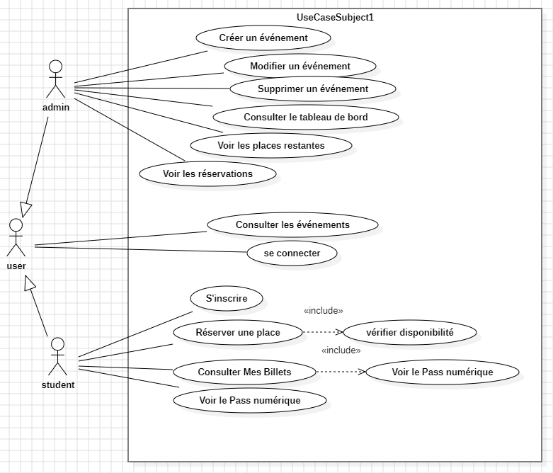
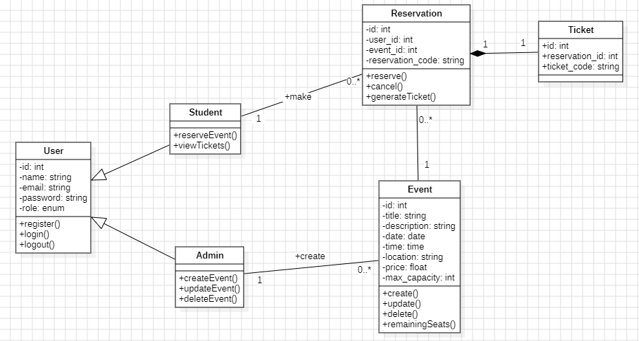
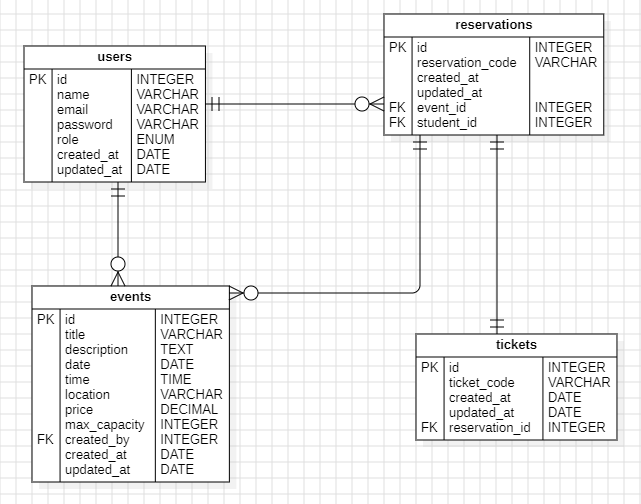

# 🎓 BDE-Events

BDE-Events is a web application developed with **Laravel 13** that centralizes the management of campus events.

The platform allows the **BDE (administrators)** to create and manage events, while **students** can reserve a place in one click and receive a unique digital ticket.

---

## 📌 Features

### 👨‍💼 Administrator (BDE)

- Authentication
- Secure admin dashboard
- Create new events
- Update existing events
- Delete events
- View all events
- View event creator
- Track reservations and remaining seats

### 🎓 Student

- Authentication
- Browse available events
- Reserve a seat in one click
- Prevent duplicate reservations
- Prevent reservation when the event is full
- Cancel a reservation
- View personal tickets
- Access a unique digital ticket for each reservation

---

## 🛠️ Technologies

- Laravel 13
- PHP 8.5
- MySQL
- Blade
- Tailwind CSS
- JavaScript
- HTML5
- CSS3

---
## Diagrams

### Use Case Diagram



### Class Diagram



### Entity Relationship Diagram (ERD)



---

## 📂 Database

The application is based on four main entities:

- Users
- Events
- Reservations
- Tickets

### Relationships

- One User can create many Events.
- One User can make many Reservations.
- One Event can have many Reservations.
- One Reservation has one Ticket.

---

## 🔒 Roles

### Admin

- Access to the admin dashboard
- Manage events
- Monitor reservations

### Student

- Browse events
- Reserve events
- View tickets
- Cancel reservations

---

## 📸 Main Functionalities

### Event Management

- Create events
- Edit events
- Delete events
- Capacity validation
- Past date validation

### Reservation System

- One-click reservation
- Capacity verification
- Duplicate reservation prevention

### Ticket Generation

Each reservation automatically generates a unique ticket containing:

- Reservation code
- Event title
- Date
- Time
- Location
- Student name

Example:

```
BDE-2026-AB12C
```

---

## 🚀 Installation

Clone the repository

```bash
git clone https://github.com/your-username/BDE-Events.git
```

Move into the project

```bash
cd BDE-Events
```

Install dependencies

```bash
composer install
```

Create the environment file

```bash
copy .env.example .env
```

Generate the application key

```bash
php artisan key:generate
```

Configure your database inside `.env`

Run migrations

```bash
php artisan migrate
```

Start the server

```bash
php artisan serve
```

---

## 📁 Project Structure

```
app/
├── Models
├── Http
│   ├── Controllers
│   └── Middleware

resources/
├── views

routes/
└── web.php
```

---

## 📊 UML

The project includes:

- Use Case Diagram
- Class Diagram
- Entity Relationship Diagram (ERD)

---

## 📋 Project Objectives

This project was developed to practice:

- Laravel MVC architecture
- Authentication
- Authorization with Middleware
- CRUD operations
- Eloquent ORM relationships
- Validation
- Database design
- Blade templating
- Git version control

---

## 👨‍💻 Author

**Badr B.**

Developed as part of the **Développeur Web et Web Mobile** training.

---

## 📄 License

This project was developed for educational purposes.